### SVM: From Theory To Practice

In this article, we are going to create a simple support vector machine using only pure Python code.

####  What is support vector machine

It is the learning model for determining the point to which a pattern belongs:

We can start with an easy linear pattern:

####  Liner SVM

The liner support machine is a primitive pattern separated by a line: where one side of the line belongs to one pattern, and the other side to another.
The goal of Linear SVM is to find a linear equation, by given points; then predict in which side the future points fall into.

 

Suppose we are given a training dataset of **n** points of the form

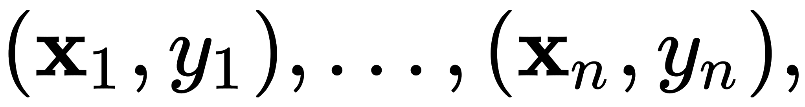 

where the 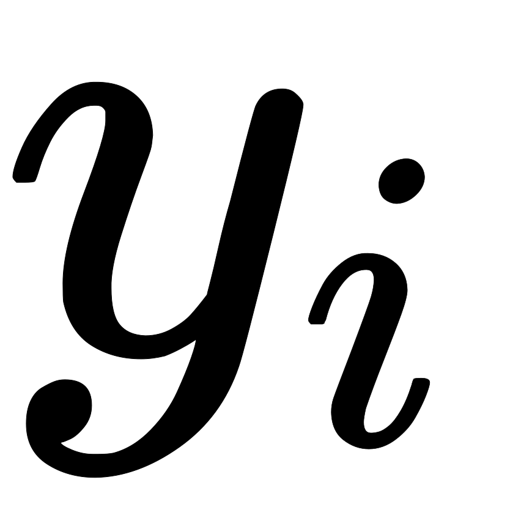 are either 1 or −1, each indicating the class to which the point 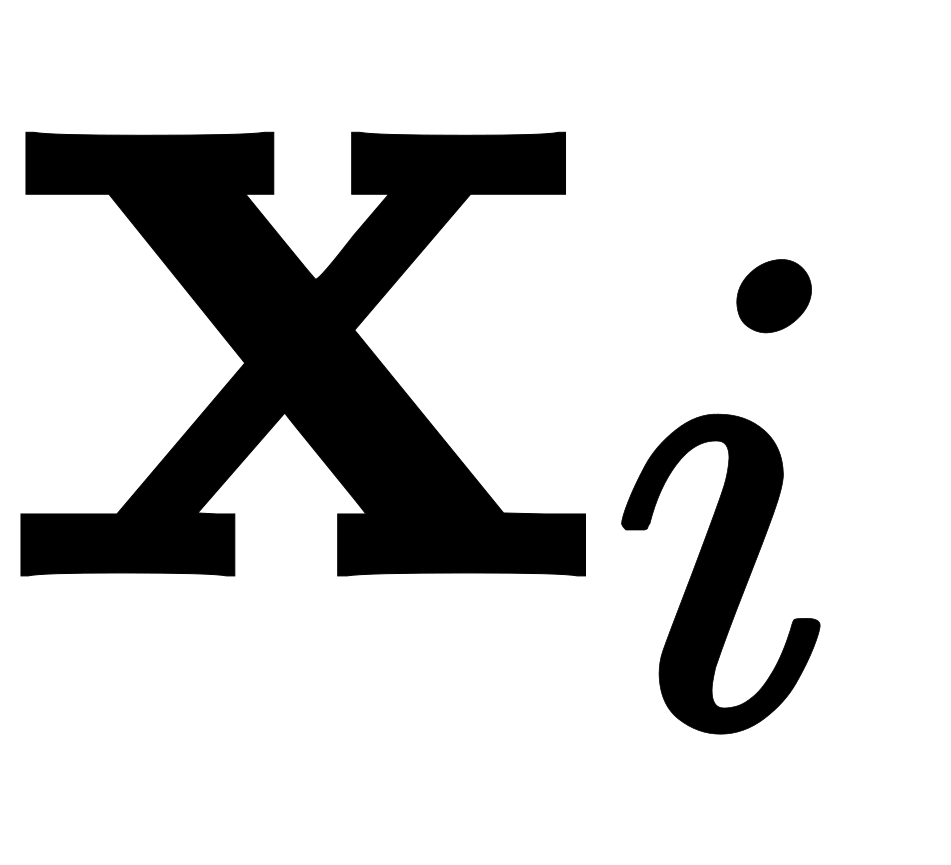 belongs. Each  p-dimensional real vector. We want to find the "maximum-margin hyperplane" that divides the group of points  for which 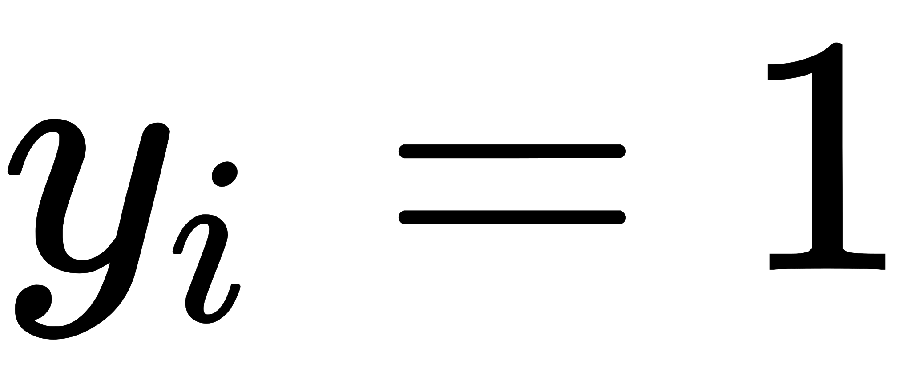 from the group of points for which , which is defined so that the distance between the hyperplane and the nearest point  from either group is maximized.

 

Where **w** is the weight vector

In this article, we are not going to calculate the equation, but you can find the full solutions here: https://en.wikipedia.org/wiki/Support_vector_machine or https://web.mit.edu/6.034/wwwbob/svm-notes-long-08.pdf

Where the final result of the equation falls into these dual equations:

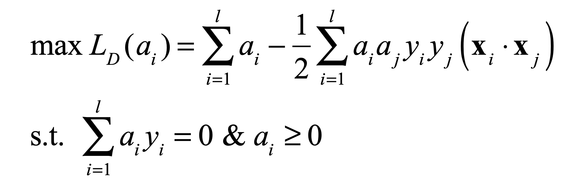 

Where (**x**i * **x**j) is a dot product:
which is the final equation for finding the linear weight. And this is the equation we are going to solve to find the independent **a** numbers for each point: where **w** weight is:

 

So, knowing all the independent **a** numbers, we can find the weight (**w**), therefore, we can find the linear function:

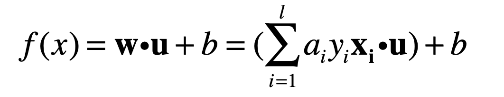 

Knowing the linear function, we can easily determine the classification of points, on which side of the line the points are located.
The last variable that is not yet known is the basis **b**, which we will get after the next paragraph:

#### Support Vector

Instead of counting all points, we can go for a trick and optimize, instead of counting all points, we take only the nearest opposite vectors to each other, and delete the rest in the calculation, because they do not affect the result (we want to find the boundaries between the patterns). These vectors are called **support vectors**

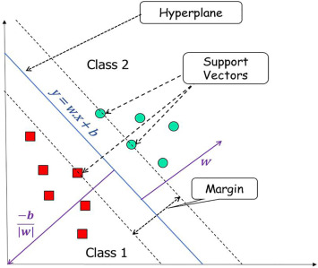 

Thus, the solution of the problem is also reduced to the search for support vectors.
Now, having the support vectors, we will get the base of all support vectors, then we will take the average, which will be the base **b** of the hyperline.


#### Non Liner SVM


#### Coordinate descent


--------------
According support vector machine therory we come on lagrangian equations: 


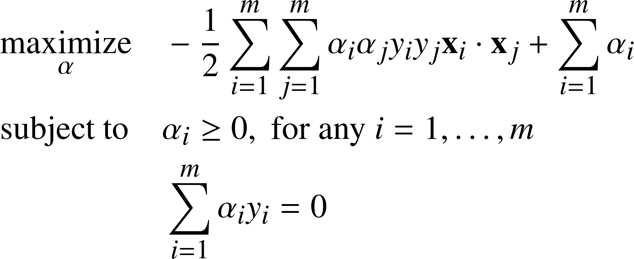 


Which is known as the “optimization problem”. Where we already have "y" and "**x**", our goal is find **α**.


There are many methods to find these variables, but my solution is solve it analytically according coordinate descent algorithm.
The purpose of this algorithm is change each **α** till lagrangian will reach his maximum, in the other hand keeping sum of **α** and **y** - zero.


Code example:

```python

def coordinate_descent(dataset, alfa, precision, delta, Q, type ):
    go = True
    while go:
        go = False
        for index, value in enumerate(dataset):
            # detecting direction which direction cause rising of lagrangian 
            direction = detect_maximum_direction(dataset, alfa, index, delta, type, Q)
            next = get_lagrangian(dataset, alfa, type, Q)
            # changing alfa[index] till lagrangian will get maximum
            while True:
                prev = next
                change_alfa(dataset, alfa, index, direction * delta)
                next = get_lagrangian(dataset, alfa, type, Q)
                if (next - prev) < precision:
                    break
                go = True
    return alfa

``` 


Having **α** we easyly can find hypreline :

weight: **w** = Sum(i) ai yi **xi**  
basis: b - avg( <**x** **w**>  )


now you can do prediction 

> Sign( **w** **x** + b) 

or
> Sign( Sum(i)( αi yi <**x**  **x_test**> ) + b )

So having **α** you can build a hyperline and make a prediction


***Finding Support Vectors***

The example we discussed supposed that we have only few vectors to analyze. But when the number of input vectors are high, "coordinate_descent" function can't find *α* because of hard work.
(remember that **α** is find analytically)

According lagrangian equations, function gets his maximum when we to take into account only those opposite vectors which distance is minimum.
So we can just filter given vectors and name theme support vectors, and process only these vectors instead of all.


Here are code how I did it

```python
def find_support_vectors(dataset, C=0.5, slack=0.5):
    distances = {}
    for i,v1 in enumerate(dataset):
        for j,v2 in enumerate(dataset):
            if i != j and v1[2] != v2[2]:
                distance = math.sqrt((v1[0] - v2[0])**2 + (v1[1] - v2[1])**2)
                if i not in distances or distance < distances[i]:
                    distances[i] = distance

    support_vectors = []
    for index,vector in enumerate(dataset):
        distance = distances[index]
        if distance > C - slack and distance < C + slack:
            support_vectors.append(vector)
    return support_vectors
```

Having support vectors we can easily analyze any complex data.


***Kernel Trick***

When we have non line data separatable, in this case we are doing some trick - instead of calculating support vectors dot product, we change it with some function.
In my example I use radial basis function (RBF) :

> exp(-Q * ∥ **x1** - **x2** ∥) 

(where Q is some adjustable constant) or :  

```python
math.exp(-Q*(x1**2 + x2**2))
``` 


***Results***

As as test I generated about 100 random points with liner and paraboloid (non liner) seperation. 
Then generated random 20 points and tested them. To show result I used matplotlib.

To test yourself - clone the project and run in your terminal `python3 predict_liner.py` to see result liner svm or `python3 predict_nonliner.py`  to see non liner result.

Example 1: Liner SVM

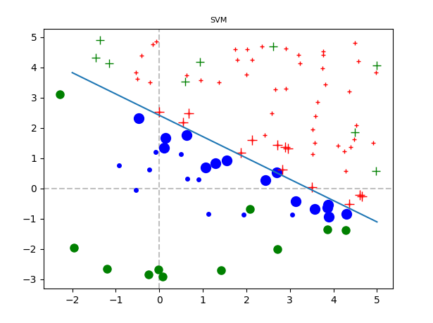 

Example 2: Non Liner SVM 

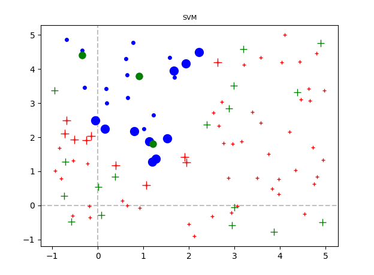 

where

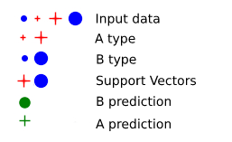
