# Support Vector Machine: From Theory to Practice

In this article, we are going to create a simple support vector machine using only pure Python code,
but before demonstrating the Python code, let's understand what SMV is and how it works.

####  What is Support Vector Machine (SVM)

Support Vector Machine (SVM) is a supervised learning algorithm that can be used for classification or regression tasks. SVM aims to find an optimal separating hyperplane that maximizes the margin between different classes in the feature space. The margin is defined as the distance between the nearest points of different classes, called support vectors. In essence, SVM searches for the decision boundary that provides the largest separation between classes.

Mathematically, let's say we have a dataset of n samples with m features, represented as:

{(x₁, y₁), (x₂, y₂), ..., (xₙ, yₙ)}

where xᵢ ∈ Rᵐ (feature vector) and yᵢ ∈ {-1, +1} (class label).

The goal is to find a hyperplane defined by the equation:

w • x + b = 0

where w ∈ Rᵐ (weight vector) and b ∈ R (bias term).

The SVM algorithm is also capable of handling non-linear classification problems using a technique called the "Kernel Trick."


#### How to find hyperplane for linear classification

The linear support vector machine is a basic classifier separated by a line: one side of the line belongs to one class, and the other side to another. The goal of Linear SVM is to find a linear equation, given a set of points, and then predict which side of the line future points will fall into.

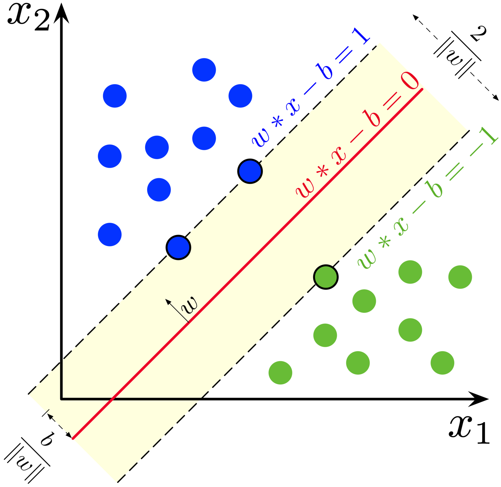 


In this article, we are not going to calculate the equation, but you can find the full solutions here: https://en.wikipedia.org/wiki/Support_vector_machine or https://web.mit.edu/6.034/wwwbob/svm-notes-long-08.pdf


To find the optimal w and b, we can use the Lagrange duality method to obtain the dual form of the optimization problem:

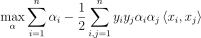   

subject to:

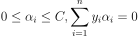 

where α is the Lagrange multiplier, yi is the class label of the ith data point, and <xi, xj> is the dot product of the ith and jth feature vectors.

Once we have obtained the optimal values of α, we can compute w and b using the following equations:

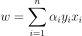

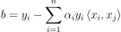

where xi is a support vector (i.e., a data point that lies on the margin or misclassified).


#### Non-linear classification: Kernel trick

In many real-world problems, the data is not linearly separable in the original feature space. In such cases, SVM can still be used for classification by mapping the input data to a higher-dimensional space where it becomes linearly separable. This mapping is performed using a kernel function. The kernel trick allows us to perform these transformations implicitly, without actually computing the coordinates of the data in the higher-dimensional space.

A kernel function K(xᵢ, xⱼ) computes the inner product of the transformed vectors, without explicitly computing the transformation ϕ(x):

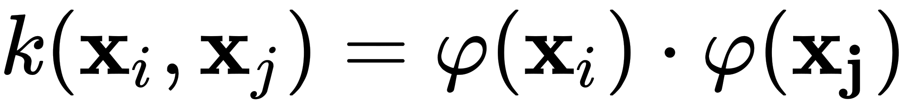

Using the kernel trick, the dual problem in the Lagrangian formulation can be rewritten as:

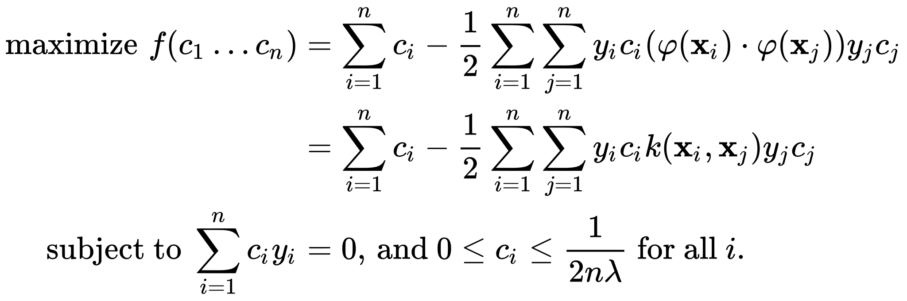

##### Popular kernel functions include:

Polynomial (homogeneous): d=1, this becomes the linear kernel.


Polynomial kernel (where γ, r, and d are kernel parameters)


Radial basis function (RBF) kernel or Gaussian kernel (where γ is a kernel parameter)

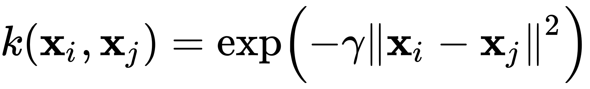

Sigmoid kernel (where γ and r are kernel parameters)

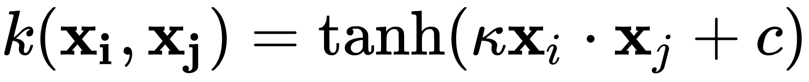

Once the optimal α values are obtained using one of the kernel functions, the decision function can be expressed as:

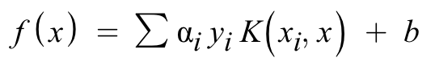

The kernel trick allows SVM to learn non-linear decision boundaries, which makes it a powerful and versatile classification algorithm for a wide range of problems.


#### Gradient descent algorithm

Gradient descent is a general optimization algorithm that can be used to find optimal parameters, such as α values (Lagrange multipliers) in SVM.

Using gradient descent in the context of SVM, consider the following steps:

* Initialize the α values: Begin with an initial set of α values, commonly αᵢ = 0 for i = 1, 2, ..., n.
* Replace each αᵢ with small portions to satisfy the dual equation - thus find optimal αᵢ

#### Support Vectors

Support vectors are the data points that are closest to this decision boundary, and they essentially "support" the position and orientation of the hyperplane.

Once we have the support vectors, it will be easier to use just the support vectors to predict future points instead of counting whole data points.

Support vectors are determined after training the SVM model using coordinate descent. Once the optimal values for the Lagrange multipliers (alphas) are obtained, support vectors are identified by checking if the alpha value for a data point lies between 0 and the regularization parameter C. If so, the data point is considered a support vector

------------------------------

## SVM Implementation in Python

The provided code is a simple implementation of a Support Vector Machine (SVM) in Python. We will go through each part of 
the code step by step.


##### Define multidimensional vector

In the beginning, let's create a sample multidimensional vector with the **dot** (dot product) and **distance** properties

```python
class Vector:
    def __init__(self, coordinates):
        ...
    def dot(self, other):
        ...
    def distance(self, other):
        ...
```

##### Define the SVM class

Then, defining SVM class with an initializer, several methods for training, and methods for predicting new data points.

```python
class SVM:
    def __init__(self, C=1.0, kernel=None):
        self.C = C
        self.data = None
        self.y = None
        self.alpha = None
        self.bias = 0
        self.kernel = kernel

        self.s_v = [] # support vectors
        self.s_y = [] # support vectors labels
        self.s_a = [] # support vectors alphas
```


The **\_\_init\_\_** method initializes the SVM with the following attributes:

- C: The regularization parameter.
- data: The training data.
- y: The labels for the training data.
- alpha: The Lagrange multipliers for the SVM optimization problem.
- bias: The bias term of the decision function.
- kernel: The kernel function used for non-linear SVM.
- s_v, s_y, s_a: Lists to store support vectors, their labels, and their corresponding alpha values.


##### The Lagrangian function

The **lagrangian** method calculates the Lagrangian function value for the given data:

```python
def lagrangian(self, data):
    n = len(self.alpha)
    return sum(self.alpha) - 0.5 * sum(self.alpha[i] *self.alpha[j] * self.y[i] * self.y[j] * self.kernel(data[i], data[j]) for i in range(n) for j in range(n))
```

##### Fit the SVM model

The **fit** method trains the SVM model on the provided data:

```python
def fit(self, data, iterations=1000, step=0.01):
    ...
```

This method performs the following steps:

- Initialize the data, labels, and alpha values.
- Train the SVM using coordinate descent.
- Find support vectors and their corresponding alpha values.
- Calculate the bias term.


##### The decision function

The **decision_function** method calculates the decision function value for a given input vector **x**:

```python
def decision_function(self, x):
    return sum(alpha_i * y_i * self.kernel(x_i, x) for alpha_i, y_i, x_i in zip(self.s_a, self.s_y, self.s_v)) + self.bias
```

##### Predict the class for a new sample

The **predict** method classifies a new data point **x** using the trained SVM model:

```python
def predict(self, x):
    return 1 if self.decision_function(Vector(x)) > 0 else -1
```

This method returns 1 if the decision function value is greater than 0, and -1 otherwise.


### Tutorials

Examples of code you can find in the tutorials folder, where there are give to examples of linear and nonlinear classifications:


To run examples, first, install the **numpy** and **matplotlib** packages to run examples:

```bash
pip3 install -r requirements.txt
```

Then try running the Python examples to see the results below:


##### Examples 1: Linear classification example

```bash
python3 tutorials/linear.py 
```
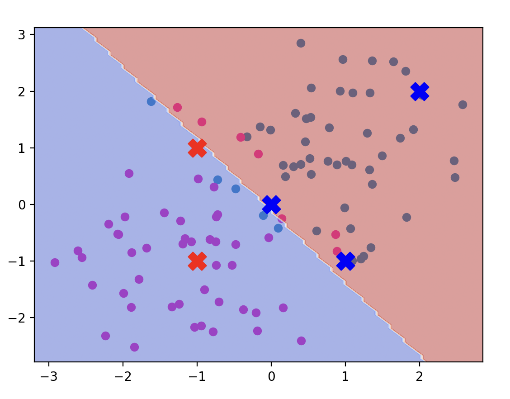 

##### Examples 2: None-Linear classification example

```bash
python3 tutorials/none-linear.py 
```
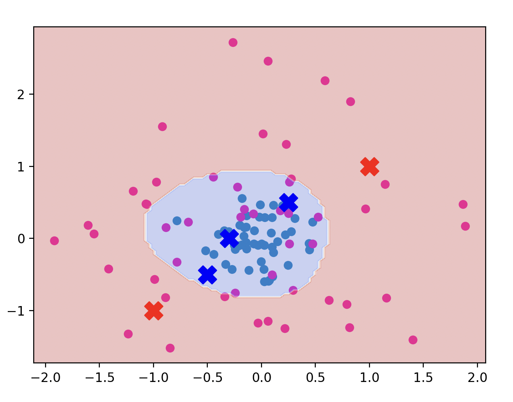 

Where the blue and red circles are the initial data points for the different classifications. So you can see the split with SVM with different backgrounds.

And the crosses are data points predicted by SVM with different colors according to the classification.

-------

The above examples demonstrate the implementation and usage of a simple Support Vector Machine in Python. In practice, you might also consider using libraries like scikit-learn for more advanced and efficient SVM implementations. However, this custom implementation can be useful for understanding the core concepts and mechanics behind SVM.